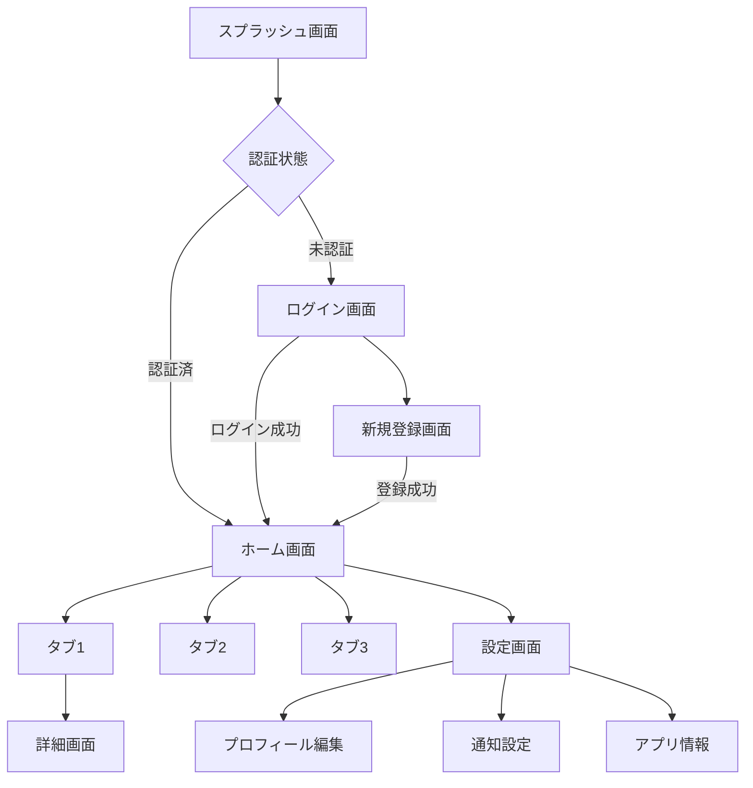

# 画面遷移・ルーティング設計

## 1. 概要

アプリケーション内の画面遷移パターン、ルーティング構造、ディープリンク対応の設計方針を定義する。

---

## 2. ナビゲーション構造

### 2.1 ナビゲーションパターン

| パターン | 使用場面 | 実装方法 |
|---|---|---|
| **スタック遷移** | 詳細画面への遷移、フォーム入力フロー | `Navigator.push` / `go_router` |
| **タブ切替** | メイン画面のセクション切替 | `BottomNavigationBar` + `IndexedStack` |
| **ドロワー** | サイドメニュー | `Drawer` |
| **モーダル** | 確認ダイアログ、ボトムシート | `showDialog` / `showModalBottomSheet` |
| **置換遷移** | ログイン→ホーム（戻れない遷移） | `Navigator.pushReplacement` |

### 2.2 画面遷移図テンプレート



---

## 3. ルート定義

### 3.1 ルーティングテーブル

| ルート名 | パス | 画面 | 認証 | パラメータ |
|---|---|---|---|---|
| splash | `/` | スプラッシュ | 不要 | - |
| login | `/login` | ログイン | 不要 | - |
| register | `/register` | 新規登録 | 不要 | - |
| home | `/home` | ホーム | 必要 | - |
| detail | `/detail/:id` | 詳細 | 必要 | `id: String` |
| settings | `/settings` | 設定 | 必要 | - |

### 3.2 ルート定義の実装例

```dart
// lib/utils/router.dart
final router = GoRouter(
  initialLocation: '/',
  redirect: (context, state) {
    final isLoggedIn = /* 認証状態チェック */;
    final isAuthRoute = state.matchedLocation == '/login'
        || state.matchedLocation == '/register';

    if (!isLoggedIn && !isAuthRoute) return '/login';
    if (isLoggedIn && isAuthRoute) return '/home';
    return null;
  },
  routes: [
    GoRoute(path: '/', builder: (_, __) => const SplashScreen()),
    GoRoute(path: '/login', builder: (_, __) => const LoginScreen()),
    GoRoute(
      path: '/home',
      builder: (_, __) => const HomeScreen(),
      routes: [
        GoRoute(
          path: 'detail/:id',
          builder: (_, state) => DetailScreen(
            id: state.pathParameters['id']!,
          ),
        ),
      ],
    ),
    GoRoute(path: '/settings', builder: (_, __) => const SettingsScreen()),
  ],
);
```

---

## 4. 画面遷移時のデータ受け渡し

### 4.1 方法の使い分け

| 方法 | 使用場面 | データサイズ | 例 |
|---|---|---|---|
| **パスパラメータ** | 必須の識別子 | 小 | `/detail/:id` |
| **クエリパラメータ** | オプションのフィルタ等 | 小 | `/list?category=food` |
| **Extra（オブジェクト渡し）** | 画面間の一時データ | 中 | 選択したアイテムオブジェクト |
| **Provider/状態管理** | 複数画面で共有 | 大 | カート内容、フォームの途中状態 |

### 4.2 画面戻り値

```dart
// 結果を受け取る遷移
final result = await Navigator.push<bool>(
  context,
  MaterialPageRoute(builder: (_) => const ConfirmScreen()),
);

if (result == true) {
  // 確認画面で承認された
}
```

---

## 5. ディープリンク設計

### 5.1 URLスキーム

| 種別 | フォーマット | 例 |
|---|---|---|
| カスタムスキーム | `myapp://[path]` | `myapp://detail/123` |
| Universal Links (iOS) | `https://[domain]/[path]` | `https://example.com/detail/123` |
| App Links (Android) | `https://[domain]/[path]` | `https://example.com/detail/123` |

### 5.2 ディープリンクルーティング

| ディープリンクパス | アプリ内遷移先 | 未認証時 | 未インストール時 |
|---|---|---|---|
| `/detail/:id` | 詳細画面 | ログイン→詳細画面 | ストアページ |
| `/settings` | 設定画面 | ログイン→設定画面 | ストアページ |
| `/invite/:code` | 招待受付画面 | 招待受付→登録 | ストア→招待受付 |

### 5.3 遅延ディープリンク

未インストール時のフロー:

```
ディープリンクタップ
  → ストアページ表示
  → インストール・起動
  → 元のディープリンク先に遷移
```

---

## 6. 画面遷移アニメーション

### 6.1 標準アニメーション

| 遷移パターン | アニメーション | Duration |
|---|---|---|
| Push（前進） | 右からスライドイン (iOS) / フェードイン (Android) | 300ms |
| Pop（後退） | 左へスライドアウト (iOS) / フェードアウト (Android) | 300ms |
| モーダル | 下からスライドアップ | 300ms |
| タブ切替 | アニメーションなし（即時切替） | 0ms |
| 置換（ログイン→ホーム） | フェード | 200ms |

### 6.2 Reduce Motion 対応

OS設定で「視差効果を減らす」が有効な場合、アニメーションを簡略化する。

```dart
final reduceMotion = MediaQuery.of(context).disableAnimations;
```

---

## 7. ナビゲーションガード

### 7.1 認証ガード

```
画面遷移リクエスト
  │
  ├─ 認証不要ルート → そのまま遷移
  │
  └─ 認証必要ルート
      ├─ 認証済み → そのまま遷移
      └─ 未認証 → ログイン画面へリダイレクト
                   → ログイン成功後、元の遷移先へ
```

### 7.2 未保存データガード

```dart
// 画面離脱時の確認
WillPopScope(
  onWillPop: () async {
    if (hasUnsavedChanges) {
      return await showDiscardDialog(context);
    }
    return true;
  },
  child: /* ... */,
);
```

---

## 変更履歴

| 日付 | バージョン | 変更内容 | 変更者 |
|---|---|---|---|
| <!-- [YYYY-MM-DD] --> | 1.0 | 初版作成 | <!-- [名前] --> |
