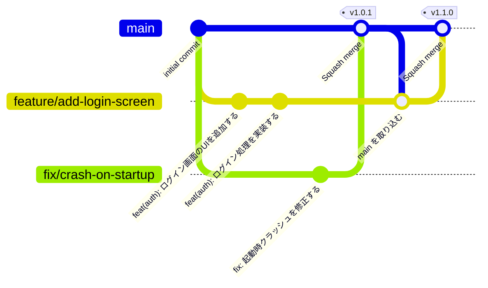

# Git 運用ルール

GitHub Flow をベースとしたブランチ戦略・コミット・レビュープロセスの規約。

---

## 目次

1. [ブランチ戦略](#1-ブランチ戦略)
2. [ブランチ命名規則](#2-ブランチ命名規則)
3. [コミットルール](#3-コミットルール)
4. [プルリクエスト](#4-プルリクエスト)
5. [マージルール](#5-マージルール)
6. [フィーチャーフラグ](#6-フィーチャーフラグ)
7. [リリースフロー](#7-リリースフロー)

---

## 1. ブランチ戦略

GitHub Flow に基づき、ブランチは **`main` と作業ブランチの2種類のみ** とする。



### ブランチの役割

| ブランチ | 説明 |
|---|---|
| `main` | 常にデプロイ可能な状態を保つ。直接プッシュ禁止 |
| 作業ブランチ | 機能・修正・その他の変更ごとに `main` から切る |

### 作業ブランチからの再分岐禁止

作業ブランチからさらにブランチを切ることは **禁止** する。

すべての作業ブランチは必ず `main` から派生させ、`main` へマージする。
作業ブランチを起点にすると、マージ順序の依存が生まれ CI の信頼性が下がるため。

分岐したくなった場合は、作業の粒度が大きすぎるサインと捉え、以下で対処する。

| 状況 | 対処法 |
|---|---|
| 機能が大きすぎる | 独立してマージできる単位に分割し、フィーチャーフラグで非公開にする |
| 複数人が同じ機能を並行作業する | 各自が `main` からブランチを切り、細かい単位でマージし合う |
| 依存関係のある作業を先行させたい | 依存部分を先に `main` にマージしてから後続ブランチを切る |

---

## 2. ブランチ命名規則

```
<type>/<kebab-case-description>
```

### type 一覧

| type | 用途 |
|---|---|
| `feature` | 新機能の追加 |
| `fix` | バグ修正 |
| `refactor` | 機能変更を伴わないリファクタリング |
| `chore` | 依存関係更新・設定変更など |
| `docs` | ドキュメントのみの変更 |
| `test` | テストの追加・修正 |

### 例

```
feature/add-user-profile-screen
fix/login-token-expiry-crash
refactor/extract-auth-repository
chore/update-flutter-3-24
docs/add-git-flow-rules
test/user-repository-unit-tests
```

---

## 3. コミットルール

[Conventional Commits](https://www.conventionalcommits.org/) に従う。

### フォーマット

```
<type>(<scope>): <subject>

[body]

[footer]
```

### type 一覧

| type | 用途 |
|---|---|
| `feat` | 新機能 |
| `fix` | バグ修正 |
| `refactor` | リファクタリング |
| `test` | テスト追加・修正 |
| `docs` | ドキュメント変更 |
| `chore` | ビルド・設定・依存関係 |
| `style` | フォーマット変更（ロジック変更なし） |
| `perf` | パフォーマンス改善 |
| `revert` | コミットの取り消し |

### scope（任意）

変更対象のレイヤー・モジュールを示す。

例: `auth`, `user`, `api`, `ui`, `routing`

### subject のルール

- 50文字以内
- 命令形で書く（「追加する」「修正する」）
- 末尾にピリオド不要
- 日本語で記述する

### 例

```
feat(auth): ログイン画面を追加する

fix(api): トークン期限切れ時にクラッシュする問題を修正する

refactor(user): UserRepositoryをインターフェース経由に変更する

chore: Flutter 3.24.0 にアップデートする
```

### コミット粒度

- **1コミット = 1つの論理的変更**
- レビュアーが差分を理解できる単位にする
- `WIP` コミットは PR マージ前に整理（squash）する

---

## 4. プルリクエスト

### 作成タイミング

- 作業を開始したら早期に **Draft PR** を作成する
- レビュー依頼時に Draft を解除する

### PR タイトル

コミットの `subject` と同じ形式に従う。

```
feat(auth): ログイン画面を追加する
fix(api): トークン期限切れ時にクラッシュする問題を修正する
```

### PR 本文テンプレート

```markdown
## 概要
<!-- この PR で何を変更するか、なぜ変更するかを説明する -->

## 変更内容
-

## 確認方法
<!-- レビュアーが動作確認できる手順を記載する -->
1.

## スクリーンショット（UI変更がある場合）

## 関連 Issue / チケット
<!-- Closes #123 など -->
```

### レビュールール

- マージには **最低1名の Approve** が必要
- CI がすべて通過していること
- 指摘コメントへの返信 or 修正が完了していること
- レビュアーは **24時間以内** に初回レビューを行う

---

## 5. マージルール

### マージ方法

| 方法 | 採用可否 | 用途 |
|---|---|---|
| Squash and merge | **推奨** | 通常の機能・修正 PR |
| Merge commit | 可 | 履歴を保持したい場合 |
| Rebase and merge | 非推奨 | コミット履歴が複雑になるため |

### マージ後

- 作業ブランチは **マージ後に削除** する
- `main` へのマージ後、CI/CD によって自動デプロイされることを想定する

---

## 6. フィーチャーフラグ

`main` にマージ済みだがユーザーに公開したくない機能は、フィーチャーフラグで制御する。
フラグが `false` の間はコードが存在してもユーザーには機能が表示・実行されない。

### 実装例

```dart
// lib/core/feature_flags.dart
abstract final class FeatureFlags {
  // TODO(yamada): 新ログイン画面が安定したら true に変更しフラグを削除する
  static bool isNewLoginEnabled = false;
}
```

```dart
// 使う側
if (FeatureFlags.isNewLoginEnabled) {
  context.push('/new-login');
} else {
  context.push('/login');
}
```

### フラグの管理方法

| 方法 | 特徴 |
|---|---|
| コード内変数 | 最もシンプル。リリース時にフラグを `true` に変えて再デプロイ |
| 環境変数 / `flutter_dotenv` | ビルド時に環境ごとに切り替え |
| Firebase Remote Config | アプリの再リリースなしにサーバーから動的に切り替え可能 |

### ルール

- フラグは **一時的なもの**。機能が安定したら速やかに削除してコードをクリーンに保つ
- フラグには必ず `TODO` コメントで担当者・削除条件を記載する

---

## 7. リリースフロー

GitHub Flow ではリリースブランチを作らず、`main` からリリースタグを打つ。

```
main
 └── (tag) v1.0.0
      └── (tag) v1.1.0
```

### タグ命名規則

[Semantic Versioning](https://semver.org/) に従う。

```
v<MAJOR>.<MINOR>.<PATCH>
```

| バージョン | 変更内容 |
|---|---|
| MAJOR | 後方互換性のない変更 |
| MINOR | 後方互換性のある機能追加 |
| PATCH | バグ修正 |

### リリース手順

1. `main` の最新コードが安定していることを確認
2. CHANGELOG を更新する PR を作成・マージ
3. GitHub の Releases からタグを作成しリリースノートを記述
