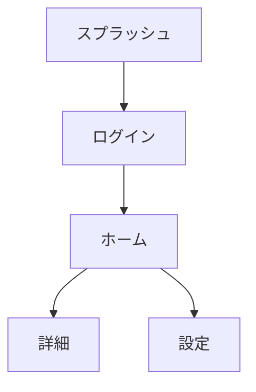

# 機能要件定義書

## 1. プロジェクト概要

| 項目 | 内容 |
|---|---|
| プロジェクト名 | <!-- [プロジェクト名] --> |
| バージョン | 1.0 |
| 最終更新日 | <!-- [YYYY-MM-DD] --> |
| ステータス | Draft |
| 作成者 | <!-- [作成者名] --> |
| 承認者 | <!-- [承認者名] --> |

### 1.1 プロダクトビジョン

<!-- [このプロダクトが解決する課題と提供する価値を記述] -->

### 1.2 ターゲットユーザー

| ユーザー種別 | 説明 | 利用頻度 |
|---|---|---|
| <!-- [種別1] --> | <!-- [説明] --> | <!-- [日次/週次/月次] --> |
| <!-- [種別2] --> | <!-- [説明] --> | <!-- [日次/週次/月次] --> |

---

## 2. ユーザーストーリー一覧

### 2.1 ユーザーストーリーマップ

<!-- ユーザーの行動フローに沿って、ストーリーを時系列で整理する -->

```
[ユーザー活動]
  ├── [タスク1]
  │   ├── US-001: [ストーリー概要]
  │   └── US-002: [ストーリー概要]
  └── [タスク2]
      ├── US-003: [ストーリー概要]
      └── US-004: [ストーリー概要]
```

### 2.2 ユーザーストーリー詳細

#### US-001: <!-- [ストーリータイトル] -->

| 項目 | 内容 |
|---|---|
| ID | US-001 |
| 優先度 | P0 / P1 / P2 / P3 |
| ステータス | Draft |
| 関連要件 | FR-001, FR-002 |

**ストーリー:**
> <!-- [ユーザー種別] -->として、<!-- [達成したいこと] -->したい。なぜなら<!-- [理由・価値] -->だからだ。

**受入条件（Acceptance Criteria）:**

- [ ] <!-- [条件1: Given-When-Then形式推奨] -->
- [ ] <!-- [条件2] -->
- [ ] <!-- [条件3] -->

**補足・制約:**

<!-- [UIモック参照先、業務ルール、例外パターン等] -->

---

## 3. 画面一覧

### 3.1 画面遷移概要

<!-- 主要な画面遷移フローを記述。Mermaid等で図示推奨 -->



### 3.2 画面定義

| 画面ID | 画面名 | 概要 | 対応ストーリー | 優先度 |
|---|---|---|---|---|
| SCR-001 | <!-- [画面名] --> | <!-- [概要] --> | US-001 | P0 |
| SCR-002 | <!-- [画面名] --> | <!-- [概要] --> | US-002 | P1 |

---

## 4. 機能一覧

### 4.1 機能カテゴリ

| カテゴリ | 説明 |
|---|---|
| 認証・認可 | ユーザー認証、権限管理 |
| データ管理 | CRUD操作、データ同期 |
| 通知 | プッシュ通知、アプリ内通知 |
| 検索・フィルタ | コンテンツの検索・絞り込み |
| ユーザー設定 | テーマ、言語、通知設定等 |
| 外部連携 | 外部API連携、ソーシャルログイン等 |

### 4.2 機能要件詳細

#### FR-001: <!-- [機能名] -->

| 項目 | 内容 |
|---|---|
| ID | FR-001 |
| カテゴリ | <!-- [認証・認可 / データ管理 / ...] --> |
| 優先度 | P0 / P1 / P2 / P3 |
| ステータス | Draft |
| 対応画面 | SCR-001 |
| 対応ストーリー | US-001 |

**概要:**
<!-- [機能の概要を1〜2文で記述] -->

**詳細仕様:**
<!-- [機能の詳細な振る舞いを記述] -->

1. <!-- [処理ステップ1] -->
2. <!-- [処理ステップ2] -->
3. <!-- [処理ステップ3] -->

**入力:**

| 項目 | 型 | 必須 | バリデーション | 備考 |
|---|---|---|---|---|
| <!-- [項目名] --> | <!-- [String/Number/...] --> | Yes/No | <!-- [ルール] --> | <!-- [備考] --> |

**出力:**

| 項目 | 型 | 説明 |
|---|---|---|
| <!-- [項目名] --> | <!-- [型] --> | <!-- [説明] --> |

**エラーケース:**

| エラー条件 | エラーメッセージ | 振る舞い |
|---|---|---|
| <!-- [条件] --> | <!-- [メッセージ] --> | <!-- [リトライ/画面遷移/...] --> |

**ビジネスルール:**
<!-- [適用される業務ルールを記述] -->

---

## 5. 共通機能要件

以下はアプリ全体に横断的に適用される機能要件である。

### 5.1 認証・セッション管理

| 要件ID | 要件 | 優先度 |
|---|---|---|
| FR-C01 | ログイン/ログアウト機能 | P0 |
| FR-C02 | セッションタイムアウト処理 | P0 |
| FR-C03 | トークンリフレッシュ | P0 |
| FR-C04 | 生体認証対応（任意） | P2 |

### 5.2 オフライン対応

| 要件ID | 要件 | 優先度 |
|---|---|---|
| FR-C05 | オフライン時のデータキャッシュ表示 | P1 |
| FR-C06 | オフライン→オンライン復帰時のデータ同期 | P1 |
| FR-C07 | オフライン状態のユーザーへの通知 | P1 |

### 5.3 プッシュ通知

| 要件ID | 要件 | 優先度 |
|---|---|---|
| FR-C08 | プッシュ通知の受信・表示 | P1 |
| FR-C09 | 通知タップ時のディープリンク遷移 | P1 |
| FR-C10 | 通知設定（カテゴリ別ON/OFF） | P2 |

### 5.4 ディープリンク

| 要件ID | 要件 | 優先度 |
|---|---|---|
| FR-C11 | URLスキームによるアプリ起動 | P1 |
| FR-C12 | Universal Links / App Links 対応 | P1 |
| FR-C13 | 未インストール時のストア誘導 | P2 |

---

## 6. リリーススコープ

### 6.1 MVP（Minimum Viable Product）

<!-- P0要件を中心に、初回リリースに含める機能を定義 -->

| 機能ID | 機能名 | 備考 |
|---|---|---|
| FR-001 | <!-- [機能名] --> | |
| FR-C01 | ログイン/ログアウト | |

### 6.2 v1.1 以降

<!-- P1〜P2要件を含む、後続リリースの計画 -->

| 機能ID | 機能名 | 予定バージョン |
|---|---|---|
| <!-- [ID] --> | <!-- [機能名] --> | v1.1 |

---

## 変更履歴

| 日付 | バージョン | 変更内容 | 変更者 |
|---|---|---|---|
| <!-- [YYYY-MM-DD] --> | 1.0 | 初版作成 | <!-- [名前] --> |
