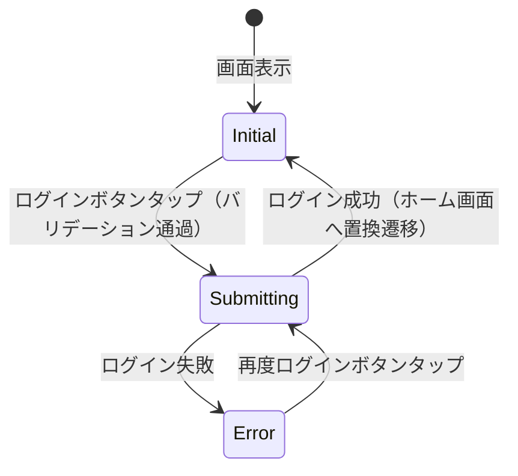

# 画面仕様: ログイン画面

## 1. 基本情報

| 項目 | 内容 |
| --- | --- |
| 画面ID | SCR-001 |
| 画面名 | ログイン画面 |
| 対応要件 | FR-C01 |
| ルートパス | /login |
| 認証要否 | 不要 |
| ステータス | Approved |
| 最終更新日 | 2026-03-17 |

## 2. 画面概要

### 2.1 目的

未認証ユーザーがメールアドレスとパスワードを入力し、アプリにログインする。

### 2.2 画面遷移

| 遷移元 | トリガー | 遷移先 |
| --- | --- | --- |
| スプラッシュ画面 | 未認証判定 | 本画面 |
| 本画面 | ログイン成功 | ホーム画面（置換遷移） |

## 3. レイアウト

```text
┌──────────────────────────┐
│       (AppLogo)          │
│                          │
│  [メールアドレス入力]     │
│  [パスワード入力]         │
│                          │
│  [ログインボタン]         │
│                          │
└──────────────────────────┘
```

## 4. UI要素詳細

### 4.1 要素一覧

| 要素ID | 要素名 | 種別 | Key |
| --- | --- | --- | --- |
| E-001 | アプリロゴ | 画像/テキスト | - |
| E-002 | メールアドレスフィールド | テキスト入力 | `email_field` |
| E-003 | パスワードフィールド | テキスト入力 | `password_field` |
| E-004 | ログインボタン | ボタン | `login_button` |

### 4.2 入力フィールド仕様

| フィールド | ラベル | 型 | 必須 | 最大長 | バリデーション | キーボード |
| --- | --- | --- | --- | --- | --- | --- |
| email | メールアドレス | email | Yes | 254 | RFC形式 | emailAddress |
| password | パスワード | password | Yes | 128 | 8文字以上 | visiblePassword |

## 5. 状態遷移

| 状態 | 条件 | 表示内容 |
| --- | --- | --- |
| Initial | 画面表示直後 | 空のフォーム、ログインボタン有効 |
| Submitting | ログインボタンタップ後 | ボタンにローディング表示、入力フィールド無効化 |
| Error | ログイン失敗 | SnackBar でエラーメッセージ、フォーム再入力可能 |



## 6. インタラクション

| アクションID | トリガー | 対象 | 処理内容 | 結果 |
| --- | --- | --- | --- | --- |
| ACT-001 | タップ | ログインボタン | バリデーション → AuthService.login() | 成功: ホーム遷移 / 失敗: SnackBar |

## 7. バリデーション

| フィールド | ルール | エラーメッセージ |
| --- | --- | --- |
| email | 空チェック | メールアドレスを入力してください |
| email | 形式チェック | 有効なメールアドレスを入力してください |
| password | 空チェック | パスワードを入力してください |
| password | 8文字以上 | パスワードは8文字以上で入力してください |

## 8. エラー表示

| エラー種別 | 表示方法 | メッセージ |
| --- | --- | --- |
| バリデーション | インラインエラー | 各フィールド固有のメッセージ |
| 認証失敗 | SnackBar | メールアドレスまたはパスワードが正しくありません |
| ネットワークエラー | SnackBar | 通信に失敗しました。再度お試しください |

## 9. アクセシビリティ

| 要素 | Semantics ラベル |
| --- | --- |
| メールアドレスフィールド | メールアドレス入力欄 |
| パスワードフィールド | パスワード入力欄 |
| ログインボタン | ログインボタン |
