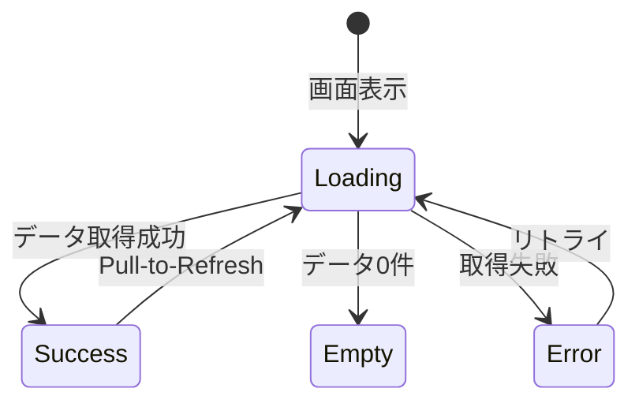

# 画面仕様: <!-- [画面名] -->

## 1. 基本情報

| 項目 | 内容 |
|---|---|
| 画面ID | SCR-XXX |
| 画面名 | <!-- [画面名] --> |
| 対応要件 | FR-XXX, FR-XXX |
| ルートパス | <!-- [例: /home] --> |
| 認証要否 | 要 / 不要 |
| ステータス | Draft |
| 最終更新日 | <!-- [YYYY-MM-DD] --> |

---

## 2. 画面概要

### 2.1 目的

<!-- この画面が果たす役割・ユーザーが達成するゴールを記述 -->

### 2.2 画面遷移

| 遷移元 | トリガー | 遷移先 |
|---|---|---|
| <!-- [画面名] --> | <!-- [操作内容] --> | 本画面 |
| 本画面 | <!-- [操作内容] --> | <!-- [画面名] --> |

---

## 3. レイアウト

### 3.1 ワイヤーフレーム

<!-- 画面のワイヤーフレーム画像への参照、またはテキストで概要を記述 -->

```
┌──────────────────────────┐
│ [AppBar: タイトル]        │
├──────────────────────────┤
│                          │
│  [コンテンツエリア]       │
│                          │
│                          │
├──────────────────────────┤
│ [BottomNavigationBar]    │
└──────────────────────────┘
```

### 3.2 レイアウト構成要素

| # | 要素 | コンポーネント | 配置 | 備考 |
|---|---|---|---|---|
| 1 | ヘッダー | AppBar | 上部固定 | <!-- [詳細] --> |
| 2 | メインコンテンツ | <!-- [Widget名] --> | スクロール可能 | <!-- [詳細] --> |
| 3 | フッター | BottomNavigationBar | 下部固定 | <!-- [詳細] --> |

---

## 4. UI要素詳細

### 4.1 要素一覧

| 要素ID | 要素名 | 種別 | 必須 | 初期状態 | 操作 |
|---|---|---|---|---|---|
| E-001 | <!-- [要素名] --> | テキスト / ボタン / 入力 / リスト / 画像 | Yes/No | <!-- [初期値/状態] --> | <!-- [タップ/入力/スワイプ] --> |
| E-002 | <!-- [要素名] --> | <!-- [種別] --> | Yes/No | <!-- [初期値/状態] --> | <!-- [操作] --> |

### 4.2 入力フィールド仕様（該当する場合）

| フィールド | ラベル | 型 | 必須 | 最大長 | バリデーション | キーボード | 備考 |
|---|---|---|---|---|---|---|---|
| <!-- [フィールド名] --> | <!-- [表示ラベル] --> | text / email / number / password | Yes/No | <!-- [文字数] --> | <!-- [ルール] --> | <!-- [text / email / number] --> | <!-- [備考] --> |

### 4.3 リスト仕様（該当する場合）

| 項目 | 内容 |
|---|---|
| リストアイテム | <!-- [アイテムの構成要素] --> |
| ソート順 | <!-- [更新日時降順 / 名前昇順 / ...] --> |
| ページネーション | あり / なし（件数: <!-- [20件/回] -->） |
| Pull-to-Refresh | あり / なし |
| 空状態表示 | <!-- [メッセージとアクション] --> |

---

## 5. 状態遷移

### 5.1 画面状態一覧

| 状態 | 条件 | 表示内容 |
|---|---|---|
| Loading | データ取得中 | ローディングインジケーター |
| Success | データ取得成功 | コンテンツ表示 |
| Empty | データ0件 | 空状態メッセージ + アクションボタン |
| Error | データ取得失敗 | エラーメッセージ + リトライボタン |

### 5.2 状態遷移図



---

## 6. インタラクション

### 6.1 アクション一覧

| アクションID | トリガー | 対象要素 | 処理内容 | 結果 |
|---|---|---|---|---|
| ACT-001 | タップ | <!-- [要素名] --> | <!-- [処理内容] --> | <!-- [画面遷移/状態変化/API呼出] --> |
| ACT-002 | スワイプ | <!-- [要素名] --> | <!-- [処理内容] --> | <!-- [結果] --> |
| ACT-003 | フォーム送信 | <!-- [送信ボタン] --> | <!-- [バリデーション→API呼出] --> | <!-- [結果] --> |

### 6.2 ジェスチャー

| ジェスチャー | 対象 | 動作 |
|---|---|---|
| Pull-down | 画面全体 | データの再取得 |
| スワイプ左 | リストアイテム | 削除アクション表示 |
| 長押し | リストアイテム | コンテキストメニュー表示 |

---

## 7. レスポンシブ対応

| ブレークポイント | レイアウト変更 |
|---|---|
| < 360dp（小型） | <!-- [調整内容] --> |
| 360dp〜428dp（標準モバイル） | 基本レイアウト |
| 429dp〜599dp（大型モバイル） | <!-- [調整内容] --> |
| 600dp〜（タブレット） | <!-- [調整内容] --> |
| Web（1024px〜） | <!-- [調整内容] --> |

---

## 8. アクセシビリティ

| 要素 | Semantics ラベル | ヒント | 備考 |
|---|---|---|---|
| <!-- [要素名] --> | <!-- [ラベル] --> | <!-- [ヒント] --> | <!-- [備考] --> |

---

## 9. エラー表示

| エラー種別 | 表示方法 | メッセージ | リカバリ |
|---|---|---|---|
| ネットワーク | エラー画面（全面） | 「インターネットに接続できません」 | リトライボタン |
| バリデーション | インラインエラー | フィールド固有のメッセージ | 入力修正 |
| サーバーエラー | SnackBar | 「処理に失敗しました。再度お試しください」 | リトライ |

---

## 10. 分析イベント

| イベント名 | トリガー | パラメータ |
|---|---|---|
| screen_view | 画面表示時 | `screen_name` |
| <!-- [イベント名] --> | <!-- [トリガー] --> | <!-- [パラメータ] --> |

---

## 変更履歴

| 日付 | バージョン | 変更内容 | 変更者 |
|---|---|---|---|
| <!-- [YYYY-MM-DD] --> | 1.0 | 初版作成 | <!-- [名前] --> |
