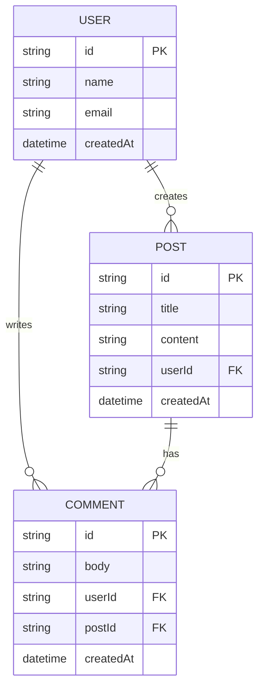

# データモデル仕様

## 1. ドキュメント情報

| 項目 | 内容 |
|---|---|
| プロジェクト名 | <!-- [プロジェクト名] --> |
| バージョン | 1.0 |
| 最終更新日 | <!-- [YYYY-MM-DD] --> |
| ステータス | Draft |

---

## 2. モデル一覧

| モデルID | モデル名 | ファイルパス | 概要 | 対応要件 |
|---|---|---|---|---|
| MDL-001 | <!-- [モデル名] --> | `lib/models/<!-- [ファイル名] -->.dart` | <!-- [概要] --> | FR-XXX |
| MDL-002 | <!-- [モデル名] --> | `lib/models/<!-- [ファイル名] -->.dart` | <!-- [概要] --> | FR-XXX |

---

## 3. モデル詳細テンプレート

### MDL-XXX: <!-- [モデル名] -->

#### 3.1 概要

| 項目 | 内容 |
|---|---|
| モデルID | MDL-XXX |
| クラス名 | <!-- [PascalCase] --> |
| 種別 | エンティティ / 値オブジェクト / DTO / Enum |
| 永続化 | あり / なし |
| API対応 | あり（JSON変換必要） / なし |

#### 3.2 フィールド定義

| フィールド名 | 型 | Nullable | デフォルト値 | 説明 | バリデーション |
|---|---|---|---|---|---|
| id | `String` | No | - | 一意識別子 (UUID) | UUID形式 |
| <!-- [name] --> | `String` | No | - | <!-- [説明] --> | <!-- [ルール] --> |
| <!-- [name] --> | `int` | No | 0 | <!-- [説明] --> | <!-- [ルール] --> |
| <!-- [name] --> | `DateTime` | No | - | <!-- [説明] --> | - |
| <!-- [name] --> | `String?` | Yes | `null` | <!-- [説明] --> | <!-- [ルール] --> |

#### 3.3 リレーション

| 関連モデル | 関係 | フィールド | 説明 |
|---|---|---|---|
| <!-- [モデル名] --> | 1:N / N:1 / 1:1 / N:M | <!-- [外部キーフィールド] --> | <!-- [説明] --> |

#### 3.4 Dart実装

```dart
class ModelName {
  final String id;
  // ... フィールド

  const ModelName({
    required this.id,
    // ...
  });

  // JSON変換（API対応ありの場合）
  factory ModelName.fromJson(Map<String, dynamic> json) {
    return ModelName(
      id: json['id'] as String,
      // ...
    );
  }

  Map<String, dynamic> toJson() {
    return {
      'id': id,
      // ...
    };
  }

  // コピーメソッド
  ModelName copyWith({
    String? id,
    // ...
  }) {
    return ModelName(
      id: id ?? this.id,
      // ...
    );
  }

  // 等価性
  @override
  bool operator ==(Object other) =>
      identical(this, other) ||
      other is ModelName && runtimeType == other.runtimeType && id == other.id;

  @override
  int get hashCode => id.hashCode;
}
```

---

## 4. 列挙型（Enum）定義

### ENM-XXX: <!-- [Enum名] -->

| 値 | 表示名 | APIキー | 説明 |
|---|---|---|---|
| <!-- [値] --> | <!-- [日本語名] --> | <!-- [APIで使用するキー] --> | <!-- [説明] --> |

```dart
enum StatusType {
  active('active', '有効'),
  inactive('inactive', '無効'),
  suspended('suspended', '停止中');

  final String apiKey;
  final String displayName;
  const StatusType(this.apiKey, this.displayName);

  factory StatusType.fromApiKey(String key) {
    return StatusType.values.firstWhere(
      (e) => e.apiKey == key,
      orElse: () => StatusType.active,
    );
  }
}
```

---

## 5. ER図

<!-- モデル間の関連をER図で表現 -->



---

## 6. データフロー

### 6.1 データの取得と変換フロー

```
API Response (JSON)
  ↓ fromJson()
Domain Model (Dart Object)
  ↓ Provider経由
Widget (UI表示)
```

### 6.2 データの送信フロー

```
Widget (ユーザー入力)
  ↓ バリデーション
Domain Model (Dart Object)
  ↓ toJson()
API Request (JSON)
```

---

## 7. ローカルキャッシュ対応（該当する場合）

| モデル | キャッシュ方式 | 有効期間 | キー | 備考 |
|---|---|---|---|---|
| <!-- [モデル名] --> | メモリ / SharedPreferences / Hive | <!-- [期間] --> | <!-- [キー] --> | <!-- [備考] --> |

---

## 8. モデル設計のガイドライン

### 8.1 必須ルール

| ルール | 説明 |
|---|---|
| Immutable | 全フィールドは `final` 宣言。変更は `copyWith` で新オブジェクト生成 |
| Null Safety | Nullable な場合のみ `?` を付与。不用意な Nullable 禁止 |
| const コンストラクタ | 可能な限り `const` コンストラクタを使用 |
| 等価性 | エンティティは `id` による等価性、値オブジェクトは全フィールドによる等価性 |

### 8.2 命名規則

| 対象 | 規則 | 例 |
|---|---|---|
| クラス名 | PascalCase | `UserProfile` |
| フィールド名 | camelCase | `firstName` |
| Enum値 | camelCase | `StatusType.active` |
| ファイル名 | snake_case | `user_profile.dart` |
| JSON キー | camelCase (APIに合わせる) | `"firstName"` |

### 8.3 コード生成の活用（任意）

大量のモデルやJSON変換が必要な場合、以下のパッケージによるコード生成を検討する。

| パッケージ | 用途 | 導入判断基準 |
|---|---|---|
| `json_serializable` | JSON変換コード自動生成 | モデル数が10以上 |
| `freezed` | Immutableクラス + copyWith + 等価性 | モデル数が10以上 |
| `equatable` | 等価性の簡易実装 | freezed未使用時 |

---

## 変更履歴

| 日付 | バージョン | 変更内容 | 変更者 |
|---|---|---|---|
| <!-- [YYYY-MM-DD] --> | 1.0 | 初版作成 | <!-- [名前] --> |
